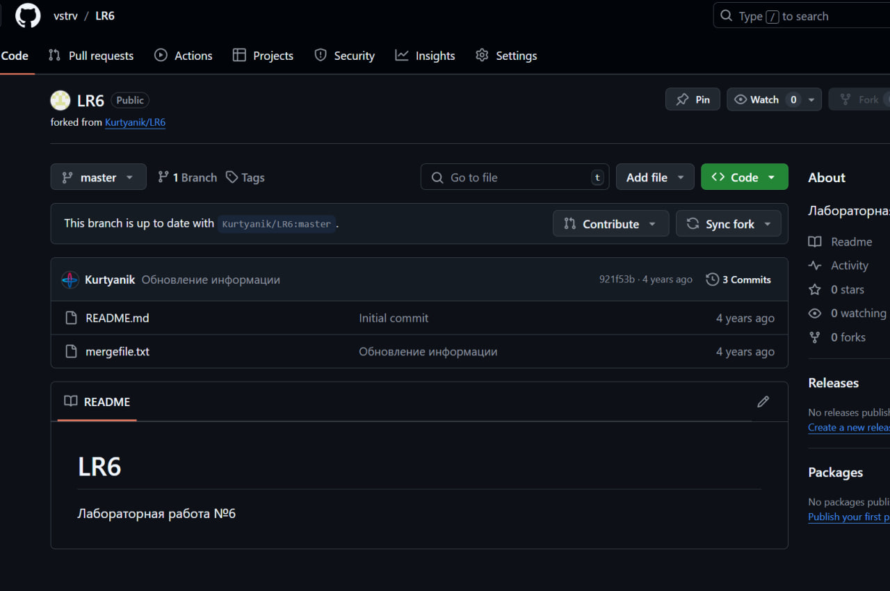
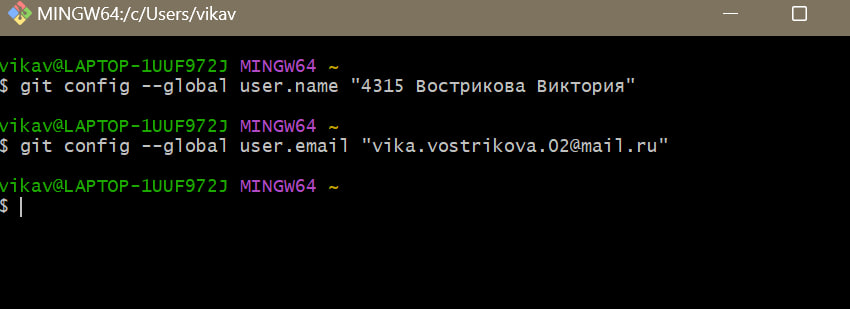
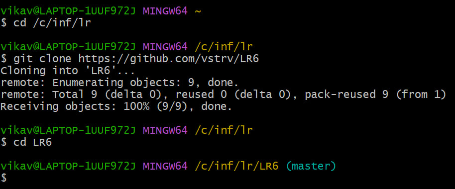
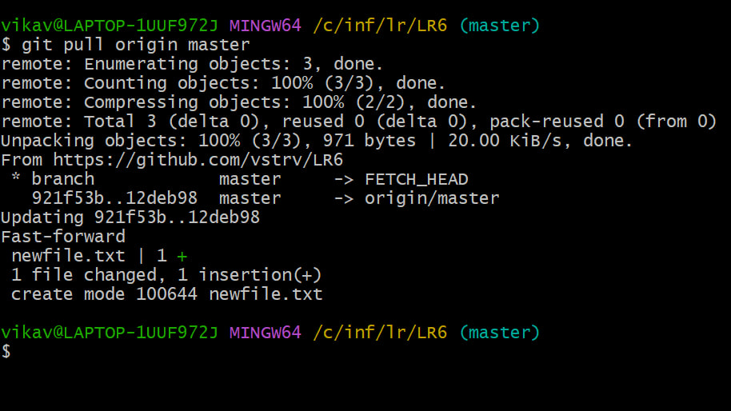
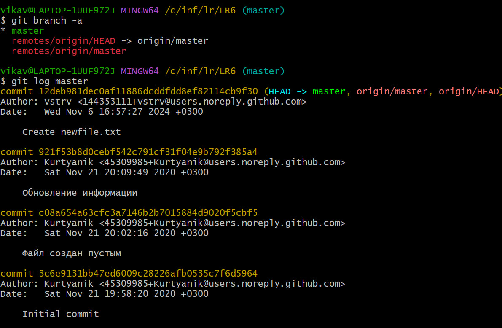

# LR6
# Лабораторная работа №6
## Цель работы
Изучение базовых возможностей системы управления версиями, опыт работы с Git API, опыт работы с локальным и удаленным репозиторием.
## Ход работы
### 1. Создание аккаунта на GitHub

### 2. Fork репозитория

### 3. Установка Git

### 4. Настройка Git

```bash
git config --global user.name "4315 Вострикова Виктория"
git config --global user.email "vika.vostrikova.02@mail.ru"
```
### 5. Клонирование репозитория

```bash
git clone https://github.com/vstrv/LR6
```
### 6. Добавление файла через GitHub и подтягивание изменений

```bash
git pull origin master
```
### 7. Получение истории операций

```bash
git log ветка
```


