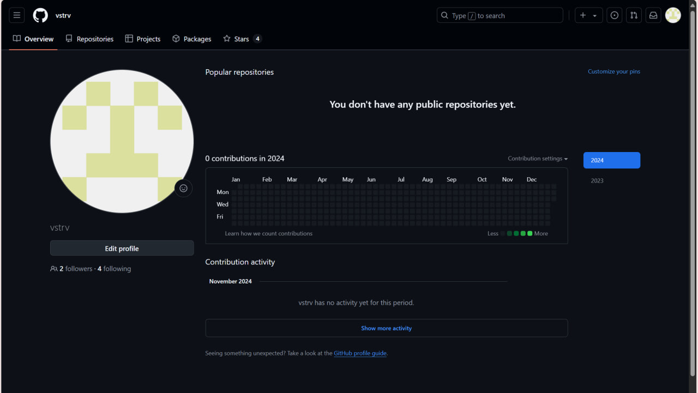

# LR6
Лабораторная работа №6
##приветик^^
# Лабораторная работа №6
Изучение базовых возможностей системы управления версиями, опыт работы с Git API, опыт работы с локальным и удаленным репозиторием.
## Ход работы
### 1. Создание аккаунта на GitHub
\
